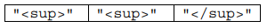

# AP-Quiz---Delimiters

# Delimiter


Many encoded strings contain delimiters. A delimiter is a non-empty string that acts as a boundary between different parts of a larger string. The delimiters involved in this question occur in pairs that must be balanced, with each pair having an open delimiter and a close delimiter. There will be only one type of delimiter for each string. The following are examples of delimiters. 

 <br></br>
**Example 1**

Expressions in mathematics use open parentheses "(" and close parentheses ")" as delimiters. For each 
open parenthesis, there must be a matching close parenthesis.


<br></br>
**Example 2**

  HTML   uses  <B>and </B> as delimiters. For each open delimiter <B>,  there must be a matching close 
delimiter </B>.


In this question, you will write two methods in the following Delimiters class.  


    
**(a)**  A string containing text and possibly delimiters has been split into tokens and stored in String[] tokens.  Each token is either an open delimiter, a close delimiter, or a substring that is not a 
delimiter. You will write the method getDelimitersList,  which returns an ArrayList containing all the open and close delimiters found in tokens in their original order. 

The following examples show the contents of an ArrayList returned by getDelimitersList for different open and close delimiters and different tokens arrays. 


Complete method getDelimitersList below. 
 ```java
/** Returns an ArrayList of delimiters from the array tokens,  as described in part (a). */ 
public ArrayList<String> getDelimitersList(String[] tokens) 
```
    
<br></br>
**(b)** Write the method isBalanced,  which returns true when the delimiters are balanced and returns false otherwise. The delimiters are balanced when  both of the following conditions are satisfied; otherwise, they are not balanced.

1. When traversing the ArrayList from the first element to the last element, there is no point at which there are more close delimiters than open delimiters at or before that point. 
2. The total number of open delimiters is equal to the total number of close delimiters.

Consider a  Delimiters object for which openDel is "<sup>" and closeDel is "</sup>".  
The examples below show different ArrayList objects that could be returned by calls to  
getDelimitersList and the value that would be returned by a call to isBalanced. 
<br></br>

**Example 1**

The following example shows an ArrayList for which isBalanced returns true.  As tokens are 
examined from first to last, the number of open delimiters is always greater than or equal to the number of 
close delimiters. After examining all tokens, there are an equal number of open and close delimiters. 


<br></br>
**Example 2**

The following example shows an ArrayList for which isBalanced returns false. 
 

<br></br>
**Example 3**

The following example shows an ArrayList for which isBalanced returns false. 


<br></br>
**Example 4**
The following example shows an ArrayList for which isBalanced returns false because the 
second condition is violated. After examining all tokens, there are not an equal number of open and close 
delimiters. 



 
    
Complete method isBalanced below. 
```java 
/** Returns true if the delimiters are balanced and false otherwise, as described in part (b). 
 *  Precondition: delimiters contains only valid open and close delimiters. 
 */ 
public boolean isBalanced(ArrayList<String> delimiters) 
```
